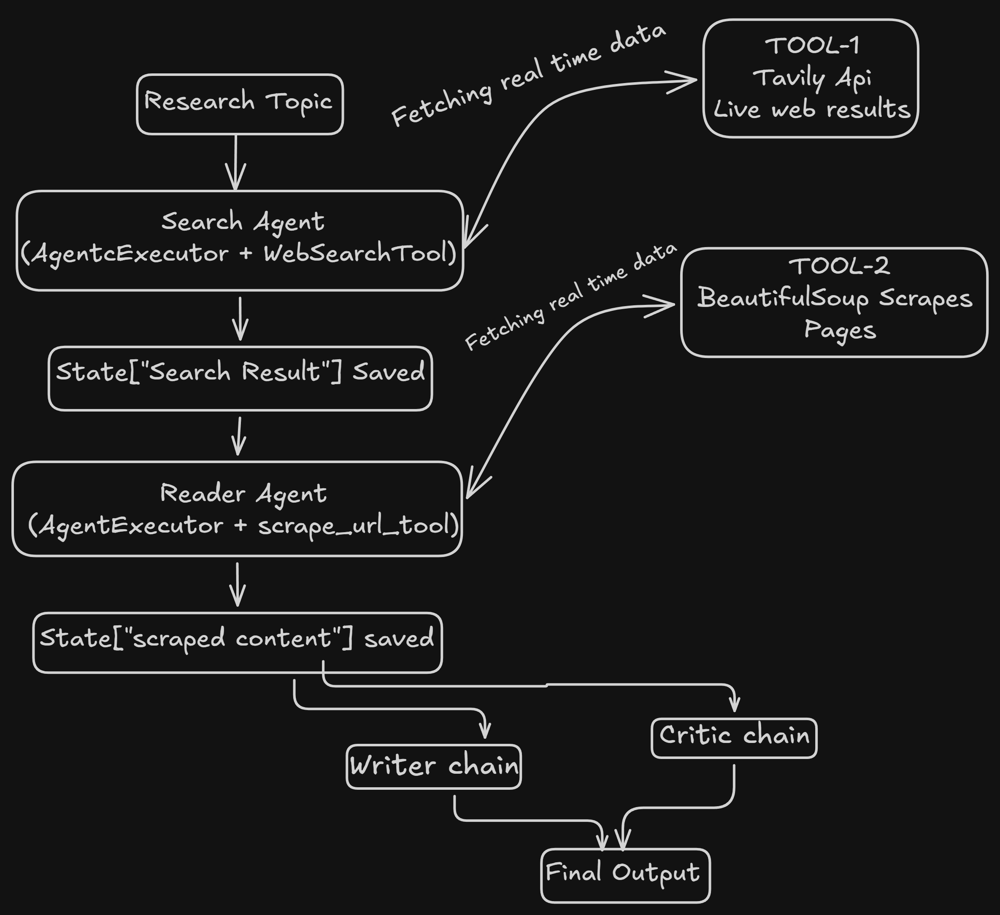

# Research Command Center

**Autonomous Multi-Agent Research Pipeline — Search, Synthesise, Scrutinise.**

---

## Architectural Overview



The system orchestrates a cascading quartet of specialised LLM-driven agents, each responsible for a discrete phase of the research lifecycle. The architecture follows a strict sequential pipeline paradigm: output from each stage becomes the contextual substrate for the subsequent stage, ensuring epistemic continuity from raw web retrieval to critical appraisal.

```
Web Search ──► Source Reading ──► Report Synthesis ──► Critical Review
```

---

## Pipeline Taxonomy

### Stage I — Search Agent
Executes synchronous information retrieval via the **Tavily** search API. The agent operatively constructs a targeted query, harvests the top-N results with accompanying snippets and provenance URLs, and returns a structured corpus of source material. This stage establishes the epistemological foundation for all downstream reasoning.

### Stage II — Reader Agent
Performs deep-content extraction by selecting the most salient URL from the search corpus and executing an HTTP GET request with subsequent HTML parsing via **BeautifulSoup**. Irrelevant structural elements (scripts, stylesheets, navigation artefacts) are excised, yielding sanitised, machine-readable textual content truncated to a manageable window for LLM consumption.

### Stage III — Writer
A prompt-chained LLM invocation that ingests both the search corpus and the scraped content, then procedurally generates a comprehensive research report. The output is structured into an executive summary, granular key findings with evidentiary support, a conclusion synthesising insights, and a cited source index.

### Stage IV — Critic
Performs a rigorous meta-evaluation of the generated report against quality heuristics. Returns a quantitative score (X/10), enumerated strengths, actionable improvement vectors, and a one-line verdict — operationalising a closed feedback loop within the pipeline.

---

## Technology Stack

| Layer | Specification |
|---|---|
| **Orchestration** | LangGraph / LangChain Agent Framework |
| **LLM Backbone** | Groq-hosted LLaMA 3.1 (8B) — sub-100ms inference |
| **Retrieval** | Tavily Search API (real-time web corpus) |
| **Extraction** | BeautifulSoup 4 + lxml HTML parser |
| **Serving** | FastAPI (async) + Uvicorn |
| **Frontend** | Single-page HTML/CSS/JS — brutalism-inspired design system |
| **Serialisation** | Pydantic v2 (strict schema enforcement) |

---

## Live Deployment

🌐 [**research-system-multiagent.onrender.com**](https://research-system-multiagent.onrender.com/) — Fully hosted instance of the Research Command Center. Submit a topic and observe the four-stage pipeline execute in real time.

---

## Local Deployment

```bash
# 1. Clone the repository
git clone https://github.com/chityalasrakshin/research-command-center
cd research-command-center

# 2. Install dependencies
pip install -r requirements.txt

# 3. Configure environment variables
cp .env.example .env
# Populate TAVILY_API_KEY and GROQ_API_KEY in .env

# 4. Initialise the server
uvicorn app:app --host 0.0.0.0 --port 8000 --reload

# 5. Navigate to http://localhost:8000
```

---

## Environment Configuration

| Variable | Description |
|---|---|
| `TAVILY_API_KEY` | Authentication token for Tavily web search |
| `GROQ_API_KEY` | Authentication token for Groq LLM inference |

---

## About the Creator

**Chityala Srakshin** — 5x hackathon laureate, building at the confluence of agentic AI, machine learning, and large-scale data systems. CS undergraduate at GRIET, Hyderabad.

[GitHub](https://github.com/chityalasrakshin) · [LinkedIn](https://linkedin.com/in/srakshin) · [Portfolio](https://srakshin.vercel.app)

---

*"Same person, different operating system."*
