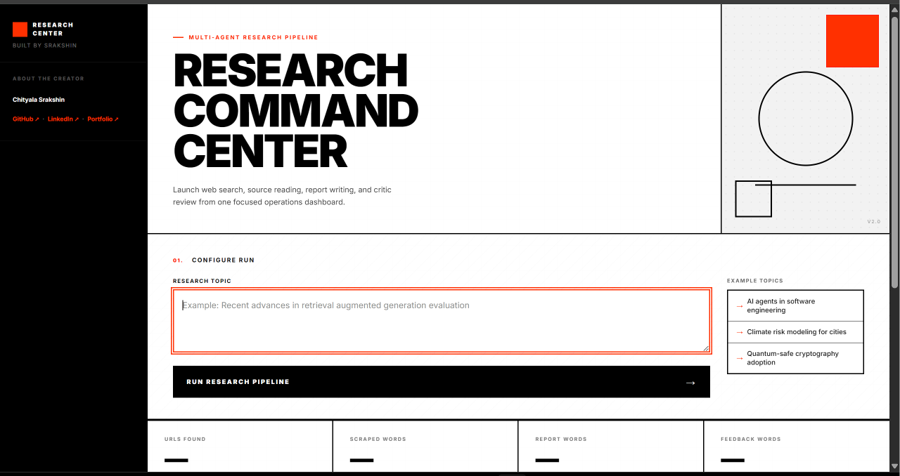

# Research Command Center

**AI-powered research tool that searches the web, reads sources, writes reports, and checks its own work.**

---

## Screenshot



*The research command center in action.*

---

## How It Works

The system uses four AI agents that work one after another:

```
Search → Read → Write → Review
```

### 1. Search Agent
Searches the web using the **Tavily** API to find the best sources on any topic.

### 2. Reader Agent
Opens the most relevant link, reads the content, and cleans it up for the next step.

### 3. Writer
Takes everything found and writes a well-structured research report with key findings and sources.

### 4. Critic
Reviews the report, scores it out of 10, and suggests what could be better.

---

## Architecture


---

## Tech Stack

| Layer | What it uses |
|---|---|
| **Framework** | LangGraph / LangChain |
| **AI Model** | LLaMA 3.1 (8B) via Groq |
| **Web Search** | Tavily API |
| **Content Extraction** | BeautifulSoup + lxml |
| **Backend** | FastAPI + Uvicorn |
| **Frontend** | Plain HTML/CSS/JS |
| **Data Validation** | Pydantic v2 |

---

## Live Demo

🌐 [**research-system-multiagent.onrender.com**](https://research-system-multiagent.onrender.com/) — Try it live. Enter a topic and watch the AI pipeline work in real time.

---

## Run Locally

```bash
git clone https://github.com/chityalasrakshin/research-command-center
cd research-command-center
pip install -r requirements.txt
cp .env.example .env
# Add your TAVILY_API_KEY and GROQ_API_KEY to .env
uvicorn app:app --host 0.0.0.0 --port 8000 --reload
```

Then open **http://localhost:8000** in your browser.

---

## Environment Variables

| Variable | What it's for |
|---|---|
| `TAVILY_API_KEY` | API key for Tavily web search |
| `GROQ_API_KEY` | API key for Groq LLM access |

---

## About

Built by **Chityala Srakshin** — 5x hackathon winner, building at the intersection of AI, ML, and data systems. CS student at GRIET, Hyderabad.

[GitHub](https://github.com/chityalasrakshin) · [LinkedIn](https://linkedin.com/in/srakshin) · [Portfolio](https://srakshin.vercel.app)

---

*"Same person, different operating system."*
